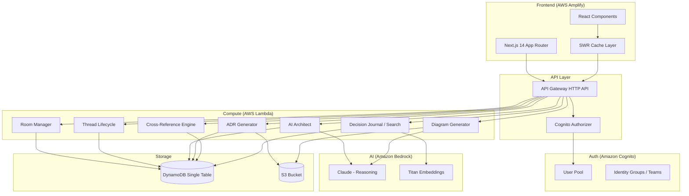
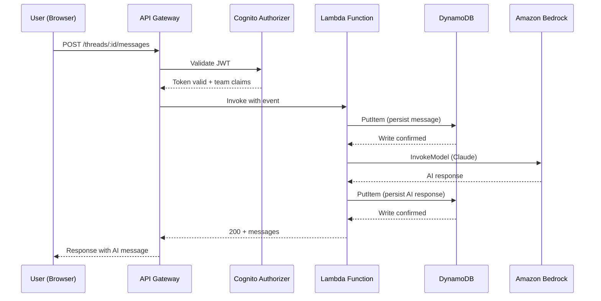
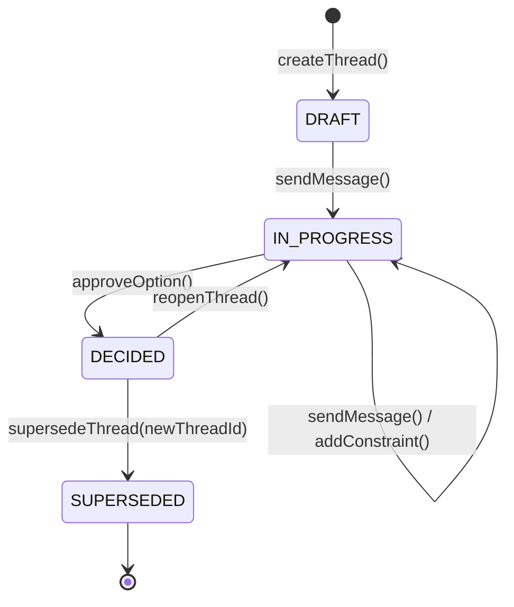
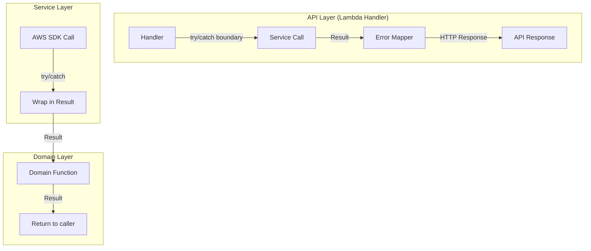

# Design Document: Architecture Decision Room

## Overview

Chalk is a serverless Architecture Decision Room that combines conversational AI with structured decision-making to produce Architecture Decision Records. The system is organized as a Next.js 14 application backed by AWS Lambda functions, DynamoDB for persistence, Amazon Bedrock for AI reasoning and embeddings, and S3 for artifact storage.

The core workflow is:
1. A user creates a **Room** (project workspace) and starts a **Decision Thread**
2. The **AI Architect** (powered by Bedrock/Claude) analyzes constraints, asks clarifying questions, proposes options with tradeoff tables
3. On approval, the thread transitions to DECIDED and an **ADR** is generated
4. All decisions are cross-referenced and semantically searchable via Titan Embeddings

Key architectural choices:
- **DynamoDB single-table design** — Rooms, threads, messages, ADRs, and cross-references share one table with carefully designed partition/sort keys and GSIs
- **Thread state machine** — Enforces valid lifecycle transitions (DRAFT → IN_PROGRESS → DECIDED → SUPERSEDED)
- **Result<T, E> pattern** — Domain logic never throws; all fallible operations return typed results
- **Write-before-acknowledge** — Messages are persisted to DynamoDB before the client receives confirmation
- **Embedding-augmented search** — Titan Embeddings stored as DynamoDB attributes enable cosine similarity without a separate vector database

## Architecture

### High-Level System Diagram



### Request Flow



### Thread State Machine



## Components and Interfaces

### Domain Layer (`src/lib/`)

#### Room Manager (`room-manager.ts`)

Handles creation, retrieval, and validation of Rooms.

```typescript
import { Result } from '@/types/result';
import { Room, RoomId, TeamId } from '@/types/domain';

export type RoomError =
  | { kind: 'EMPTY_NAME' }
  | { kind: 'NAME_TOO_LONG'; maxLength: number }
  | { kind: 'DUPLICATE_NAME'; existingId: RoomId }
  | { kind: 'NOT_FOUND'; roomId: RoomId }
  | { kind: 'PERSISTENCE_FAILURE'; cause: string };

export function validateRoomName(name: string): Result<string, RoomError>;

export function createRoom(params: {
  name: string;
  teamId: TeamId;
  createdBy: string;
}): Result<Room, RoomError>;

export function getRoom(roomId: RoomId, teamId: TeamId): Promise<Result<Room, RoomError>>;

export function listRoomsForTeam(teamId: TeamId): Promise<Result<Room[], RoomError>>;
```

#### Thread Lifecycle (`thread-lifecycle.ts`)

Enforces the thread state machine. All status transitions go through this module.

```typescript
import { Result } from '@/types/result';
import { DecisionThread, ThreadId, RoomId, ThreadStatus, Option } from '@/types/domain';

export type ThreadError =
  | { kind: 'INVALID_TRANSITION'; from: ThreadStatus; to: ThreadStatus; validTargets: ThreadStatus[] }
  | { kind: 'NOT_FOUND'; threadId: ThreadId }
  | { kind: 'PERSISTENCE_FAILURE'; cause: string };

// Valid transitions encoded as a map
export const VALID_TRANSITIONS: Record<ThreadStatus, ThreadStatus[]> = {
  DRAFT: ['IN_PROGRESS'],
  IN_PROGRESS: ['DECIDED'],
  DECIDED: ['IN_PROGRESS', 'SUPERSEDED'],
  SUPERSEDED: [],
};

export function createThread(params: {
  roomId: RoomId;
  title: string;
  createdBy: string;
}): Result<DecisionThread, ThreadError>;

export function transition(
  thread: DecisionThread,
  targetStatus: ThreadStatus,
  metadata?: { selectedOption?: Option; supersededBy?: ThreadId; reopenReason?: string }
): Result<DecisionThread, ThreadError>;

export function canTransition(from: ThreadStatus, to: ThreadStatus): boolean;
```

#### AI Architect (`ai-architect.ts`)

Orchestrates Bedrock Claude interactions for option proposals, clarifying questions, and tradeoff tables.

```typescript
import { Result } from '@/types/result';
import { Message, OptionProposal, TradeoffTable, ClarifyingQuestion } from '@/types/domain';

export type AIError =
  | { kind: 'BEDROCK_INVOCATION_FAILURE'; cause: string }
  | { kind: 'RESPONSE_VALIDATION_FAILURE'; rawResponse: string }
  | { kind: 'INSUFFICIENT_CONTEXT'; missing: string[] }
  | { kind: 'RATE_LIMITED'; retryAfterMs: number };

export function assessInputSufficiency(
  messages: Message[],
  priorADRs: { id: string; title: string; context: string }[]
): Promise<Result<
  | { sufficient: true }
  | { sufficient: false; questions: ClarifyingQuestion[] },
  AIError
>>;

export function proposeOptions(params: {
  messages: Message[];
  constraints: string[];
  priorDecisions: { id: string; title: string; relevance: string }[];
}): Promise<Result<OptionProposal, AIError>>;

export function regenerateTradeoffTable(params: {
  previousTable: TradeoffTable;
  newConstraints: string[];
  messages: Message[];
}): Promise<Result<{ table: TradeoffTable; changes: string[] }, AIError>>;
```

#### ADR Generator (`adr-generator.ts`)

Produces structured ADR documents from decided threads.

```typescript
import { Result } from '@/types/result';
import { ADR, DecisionThread, CrossReference } from '@/types/domain';

export type ADRError =
  | { kind: 'INSUFFICIENT_CONTEXT'; missingSections: string[] }
  | { kind: 'GENERATION_FAILURE'; cause: string; attempt: number }
  | { kind: 'S3_UPLOAD_FAILURE'; cause: string };

export function generateADR(params: {
  thread: DecisionThread;
  selectedOption: string;
  crossReferences: CrossReference[];
  nextSequentialId: number;
}): Promise<Result<ADR, ADRError>>;

export function exportADRToS3(adr: ADR): Promise<Result<{ s3Key: string }, ADRError>>;
```

#### Cross-Reference Engine (`cross-reference.ts`)

Manages relationships between threads/ADRs and traverses the decision graph.

```typescript
import { Result } from '@/types/result';
import { CrossReference, ThreadId, RoomId } from '@/types/domain';

export type CrossRefError =
  | { kind: 'SELF_REFERENCE' }
  | { kind: 'TARGET_NOT_FOUND'; targetId: ThreadId }
  | { kind: 'PERSISTENCE_FAILURE'; cause: string };

export type ReferenceType = 'SUPERSEDES' | 'DEPENDS_ON' | 'CONTRADICTS' | 'RELATED_TO';

export function createCrossReference(params: {
  sourceThreadId: ThreadId;
  targetThreadId: ThreadId;
  referenceType: ReferenceType;
  description: string;
}): Result<CrossReference, CrossRefError>;

export function findRelatedDecisions(params: {
  roomId: RoomId;
  currentThreadId: ThreadId;
  threadContent: string;
  existingADRs: { id: string; title: string; context: string; embedding: number[] }[];
  queryEmbedding: number[];
  similarityThreshold?: number;
}): Result<{ id: string; title: string; relevance: string; score: number }[], CrossRefError>;

export function getReferencesForThread(
  threadId: ThreadId
): Promise<Result<CrossReference[], CrossRefError>>;
```

#### Decision Journal (`decision-journal.ts`)

Handles semantic search and structured filtering of the decision history.

```typescript
import { Result } from '@/types/result';
import { SearchResult, ThreadStatus } from '@/types/domain';

export type SearchError =
  | { kind: 'EMPTY_QUERY' }
  | { kind: 'EMBEDDING_FAILURE'; cause: string }
  | { kind: 'QUERY_FAILURE'; cause: string };

export function semanticSearch(params: {
  roomId: string;
  query: string;
  filters?: {
    status?: ThreadStatus;
    dateRange?: { from: Date; to: Date };
    title?: string;
  };
  limit?: number;
  minSimilarity?: number;
}): Promise<Result<SearchResult[], SearchError>>;

export function generateEmbedding(text: string): Promise<Result<number[], SearchError>>;

export function cosineSimilarity(a: number[], b: number[]): number;
```

### Service Layer (`src/services/`)

#### Bedrock Service (`bedrock.ts`)

```typescript
import { Result } from '@/types/result';

export type BedrockError =
  | { kind: 'INVOCATION_FAILURE'; statusCode: number; message: string }
  | { kind: 'THROTTLED'; retryAfterMs: number }
  | { kind: 'VALIDATION_ERROR'; message: string };

export function invokeClaudeModel(params: {
  systemPrompt: string;
  messages: { role: 'user' | 'assistant'; content: string }[];
  maxTokens?: number;
  temperature?: number;
}): Promise<Result<string, BedrockError>>;

export function generateTitanEmbedding(
  text: string
): Promise<Result<number[], BedrockError>>;
```

#### DynamoDB Service (`dynamo.ts`)

```typescript
import { Result } from '@/types/result';

export type DynamoError =
  | { kind: 'WRITE_FAILURE'; cause: string }
  | { kind: 'READ_FAILURE'; cause: string }
  | { kind: 'CONDITION_CHECK_FAILED'; message: string }
  | { kind: 'RETRIES_EXHAUSTED'; attempts: number; lastError: string };

export function putItem<T>(params: {
  item: T;
  conditionExpression?: string;
}): Promise<Result<T, DynamoError>>;

export function getItem<T>(params: {
  pk: string;
  sk: string;
}): Promise<Result<T | null, DynamoError>>;

export function query<T>(params: {
  pk: string;
  skPrefix?: string;
  indexName?: string;
  limit?: number;
  filterExpression?: string;
}): Promise<Result<T[], DynamoError>>;

export function putItemWithRetry<T>(
  item: T,
  maxRetries?: number,
  baseDelayMs?: number
): Promise<Result<T, DynamoError>>;
```

#### S3 Service (`s3.ts`)

```typescript
import { Result } from '@/types/result';

export type S3Error =
  | { kind: 'UPLOAD_FAILURE'; cause: string }
  | { kind: 'DOWNLOAD_FAILURE'; cause: string }
  | { kind: 'NOT_FOUND'; key: string };

export function uploadDocument(params: {
  key: string;
  body: string | Buffer;
  contentType: string;
}): Promise<Result<{ key: string; url: string }, S3Error>>;

export function getDocument(key: string): Promise<Result<{ body: string; contentType: string }, S3Error>>;
```

### Types (`src/types/`)

#### Result Type (`result.ts`)

```typescript
export type Result<T, E> =
  | { ok: true; value: T }
  | { ok: false; error: E };

export function ok<T>(value: T): Result<T, never> {
  return { ok: true, value };
}

export function err<E>(error: E): Result<never, E> {
  return { ok: false, error };
}

export function isOk<T, E>(result: Result<T, E>): result is { ok: true; value: T } {
  return result.ok;
}

export function isErr<T, E>(result: Result<T, E>): result is { ok: false; error: E } {
  return !result.ok;
}

export function map<T, U, E>(result: Result<T, E>, fn: (value: T) => U): Result<U, E> {
  return result.ok ? ok(fn(result.value)) : result;
}

export function flatMap<T, U, E>(result: Result<T, E>, fn: (value: T) => Result<U, E>): Result<U, E> {
  return result.ok ? fn(result.value) : result;
}
```

## Data Models

### DynamoDB Single-Table Design

All entities share a single DynamoDB table (`ChalkTable`) with the following access patterns driven by partition key (PK) and sort key (SK) design:

#### Key Schema

| Entity | PK | SK | Purpose |
|--------|----|----|---------|
| Room | `TEAM#{teamId}` | `ROOM#{roomId}` | List rooms by team |
| Thread | `ROOM#{roomId}` | `THREAD#{threadId}` | List threads in room |
| Message | `THREAD#{threadId}` | `MSG#{timestamp}#{messageId}` | Messages in order |
| ADR | `ROOM#{roomId}` | `ADR#{adrId}` | List ADRs in room |
| CrossRef | `THREAD#{threadId}` | `XREF#{targetThreadId}` | References from thread |
| Embedding | `ROOM#{roomId}` | `EMB#{entityType}#{entityId}` | Embeddings by room |
| User | `USER#{userId}` | `PROFILE` | User profile |
| TeamMember | `TEAM#{teamId}` | `MEMBER#{userId}` | Team membership |

#### Global Secondary Indexes (GSIs)

| GSI Name | PK | SK | Use Case |
|----------|----|----|----------|
| GSI1 (StatusIndex) | `ROOM#{roomId}` | `STATUS#{status}#DATE#{isoDate}` | Filter threads by status + date |
| GSI2 (UserIndex) | `USER#{userId}` | `ROOM#{roomId}` | List rooms a user belongs to |
| GSI3 (ADRIndex) | `ROOM#{roomId}` | `ADR_SEQ#{sequentialId}` | Get next ADR sequential ID |

#### Entity Schemas

```typescript
// Room entity
interface RoomItem {
  PK: `TEAM#${string}`;
  SK: `ROOM#${string}`;
  GSI2PK?: `USER#${string}`;
  GSI2SK?: `ROOM#${string}`;
  entityType: 'ROOM';
  roomId: string;
  teamId: string;
  name: string;
  createdBy: string;
  createdAt: string; // ISO 8601
  threadCount: number;
}

// Decision Thread entity
interface ThreadItem {
  PK: `ROOM#${string}`;
  SK: `THREAD#${string}`;
  GSI1PK: `ROOM#${string}`;
  GSI1SK: `STATUS#${ThreadStatus}#DATE#${string}`;
  entityType: 'THREAD';
  threadId: string;
  roomId: string;
  title: string;
  status: ThreadStatus;
  createdBy: string;
  createdAt: string;
  updatedAt: string;
  selectedOption?: string;
  reopenMarkers?: { timestamp: string; reason: string }[];
  supersededBy?: string;
}

// Message entity
interface MessageItem {
  PK: `THREAD#${string}`;
  SK: `MSG#${string}#${string}`;
  entityType: 'MESSAGE';
  messageId: string;
  threadId: string;
  sender: string; // userId or 'ai_architect'
  content: string;
  structuredData?: {
    type: 'options' | 'tradeoff_table' | 'clarifying_questions' | 'adr';
    payload: unknown;
  };
  createdAt: string;
}

// ADR entity
interface ADRItem {
  PK: `ROOM#${string}`;
  SK: `ADR#${string}`;
  GSI3PK: `ROOM#${string}`;
  GSI3SK: `ADR_SEQ#${string}`; // zero-padded: ADR_SEQ#001
  entityType: 'ADR';
  adrId: string;
  roomId: string;
  threadId: string;
  sequentialId: number;
  title: string;
  status: 'ACTIVE' | 'SUPERSEDED';
  date: string;
  context: string;
  optionsConsidered: { name: string; summary: string }[];
  decision: string;
  consequences: string;
  relatedDecisions: { adrId: string; title: string; relationship: string }[];
  diagramS3Key?: string;
  s3ExportKey?: string;
  createdAt: string;
  updatedAt: string;
}

// Cross-Reference entity
interface CrossReferenceItem {
  PK: `THREAD#${string}`;
  SK: `XREF#${string}`;
  entityType: 'CROSS_REFERENCE';
  sourceThreadId: string;
  targetThreadId: string;
  referenceType: 'SUPERSEDES' | 'DEPENDS_ON' | 'CONTRADICTS' | 'RELATED_TO';
  description: string;
  createdAt: string;
}

// Embedding entity
interface EmbeddingItem {
  PK: `ROOM#${string}`;
  SK: `EMB#${string}#${string}`;
  entityType: 'EMBEDDING';
  roomId: string;
  entityId: string;
  entityTypeRef: 'THREAD' | 'ADR';
  embedding: number[]; // 1536-dimensional Titan vector
  textSummary: string; // ≤200 chars for search result display
  createdAt: string;
  updatedAt: string;
}
```

#### Access Patterns Summary

| Operation | Key Condition | Index |
|-----------|--------------|-------|
| Get all rooms for a team | PK = `TEAM#{teamId}`, SK begins_with `ROOM#` | Table |
| Get all threads in a room | PK = `ROOM#{roomId}`, SK begins_with `THREAD#` | Table |
| Get messages in a thread (chronological) | PK = `THREAD#{threadId}`, SK begins_with `MSG#` | Table |
| Get ADRs in a room | PK = `ROOM#{roomId}`, SK begins_with `ADR#` | Table |
| Get cross-references for a thread | PK = `THREAD#{threadId}`, SK begins_with `XREF#` | Table |
| Filter threads by status + date | GSI1PK = `ROOM#{roomId}`, GSI1SK between range | GSI1 |
| List rooms for a user | GSI2PK = `USER#{userId}` | GSI2 |
| Get next ADR sequential ID | GSI3PK = `ROOM#{roomId}`, SK begins_with `ADR_SEQ#` (reverse, limit 1) | GSI3 |
| Semantic search (all embeddings in room) | PK = `ROOM#{roomId}`, SK begins_with `EMB#` | Table |

## Correctness Properties

*A property is a characteristic or behavior that should hold true across all valid executions of a system — essentially, a formal statement about what the system should do. Properties serve as the bridge between human-readable specifications and machine-verifiable correctness guarantees.*

### Property 1: Room creation invariants

*For any* string with length between 1 and 100 characters (inclusive), calling `createRoom` with that name SHALL produce a Room with a unique non-empty ID, the exact given name, a valid ISO 8601 creation timestamp, a threadCount of 0, and the correct team association.

**Validates: Requirements 1.1, 1.2**

### Property 2: Invalid room name rejection

*For any* string that is empty, composed entirely of whitespace, or exceeds 100 characters in length, calling `validateRoomName` SHALL return an error Result with the appropriate error kind (`EMPTY_NAME` or `NAME_TOO_LONG`).

**Validates: Requirements 1.5**

### Property 3: Thread creation produces DRAFT status

*For any* valid Room and any non-empty title string, calling `createThread` SHALL produce a DecisionThread with status `DRAFT`, a unique non-empty threadId, and the provided title.

**Validates: Requirements 2.1**

### Property 4: Valid thread transitions produce correct state

*For any* DecisionThread in a given status, applying a transition to a status that exists in `VALID_TRANSITIONS[currentStatus]` SHALL succeed and produce a thread with the target status and an updated timestamp. Specifically:
- DRAFT → IN_PROGRESS records a transition timestamp
- IN_PROGRESS → DECIDED records the selected option
- DECIDED → IN_PROGRESS appends a reopen marker with timestamp and reason
- DECIDED → SUPERSEDED stores the superseding thread's ID as a cross-reference

**Validates: Requirements 2.2, 2.3, 2.4, 2.5**

### Property 5: Invalid thread transitions are rejected

*For any* DecisionThread with status S and *for any* target status T where T is NOT in `VALID_TRANSITIONS[S]`, calling `transition(thread, T)` SHALL return an error Result with kind `INVALID_TRANSITION` containing the current status, attempted target, and the list of valid target statuses from S.

**Validates: Requirements 2.6**

### Property 6: Option proposal structural validity

*For any* OptionProposal generated by the AI Architect, the proposal SHALL contain between 2 and 5 options (inclusive). Each option SHALL have: a summary of at most 200 characters, at least 2 benefits, at least 2 risks, and a complexity value in the set {Low, Medium, High}. The accompanying TradeoffTable SHALL have exactly one row per option and one column per stated constraint.

**Validates: Requirements 3.2, 3.3**

### Property 7: Clarifying questions are well-formed

*For any* set of clarifying questions generated by `assessInputSufficiency`, the set SHALL contain between 1 and 5 questions (inclusive), and each question SHALL include a non-empty relevance explanation referencing the specific constraint or tradeoff it would clarify.

**Validates: Requirements 4.1, 4.2**

### Property 8: ADR contains all required sections

*For any* ADR generated from a decided thread, the ADR SHALL contain: a sequential identifier matching the pattern `ADR-NNN`, a non-empty title, a valid date, a status of `ACTIVE`, non-empty context, at least 2 options considered (matching the thread's proposals), a non-empty decision statement, and non-empty consequences section.

**Validates: Requirements 5.1**

### Property 9: ADR includes cross-references when present

*For any* DecisionThread that has one or more CrossReferences, the generated ADR SHALL include a "Related Decisions" section listing every referenced ADR by its identifier and title.

**Validates: Requirements 5.3**

### Property 10: ADR supersession updates status correctly

*For any* ADR with status `ACTIVE`, when the associated thread is superseded, the ADR status SHALL update to `SUPERSEDED` and SHALL store a reference to the superseding ADR's identifier.

**Validates: Requirements 5.4**

### Property 11: Insufficient context ADR error enumerates missing sections

*For any* thread data that is missing one or more required ADR sections (context, decision, options), the ADR generation SHALL return an error Result with kind `INSUFFICIENT_CONTEXT` containing a `missingSections` array that lists exactly those sections that lack sufficient information.

**Validates: Requirements 5.6**

### Property 12: Semantic search results are ranked by similarity and bounded

*For any* set of embedding vectors in a room and *for any* query embedding, the search results SHALL be returned in descending order of cosine similarity score and SHALL contain at most 50 results, all with similarity scores ≥ 0.7.

**Validates: Requirements 7.1, 7.5**

### Property 13: Structured filters intersect correctly with results

*For any* combination of filters (status, date range, title substring) applied to a set of threads/ADRs, every result SHALL satisfy ALL applied filter criteria simultaneously. Results not matching any single filter SHALL be excluded.

**Validates: Requirements 7.2**

### Property 14: Search result structure completeness

*For any* search result returned by the Decision Journal, the result SHALL include: a non-empty title, a valid ThreadStatus, a valid date, a numeric similarity score between 0 and 1, and a text summary of at most 200 characters.

**Validates: Requirements 7.3**

### Property 15: Empty/whitespace search query rejection

*For any* string that is empty or composed entirely of whitespace characters, calling `semanticSearch` SHALL return an error Result with kind `EMPTY_QUERY` without executing any embedding generation or similarity computation.

**Validates: Requirements 7.6**

### Property 16: Cosine similarity is symmetric and bounded

*For any* two embedding vectors of equal dimension, `cosineSimilarity(a, b)` SHALL equal `cosineSimilarity(b, a)` and the result SHALL be in the range [-1, 1].

**Validates: Requirements 7.1** (mathematical correctness of the similarity function)

### Property 17: Team-scoped room access

*For any* Room associated with teamId T, and *for any* user U: if U belongs to team T, access SHALL be granted; if U does NOT belong to team T, access SHALL be denied with an authorization error.

**Validates: Requirements 10.3, 10.4**

### Property 18: User identity attribution

*For any* entity (Message, DecisionThread, or ADR) created by a user, the entity SHALL store the creating user's Cognito identity (userId) in a non-empty `createdBy` or `sender` field.

**Validates: Requirements 10.7**

### Property 19: Write retry with exponential backoff

*For any* DynamoDB write failure sequence, the retry mechanism SHALL attempt at most 3 retries, and the delay between attempt N and attempt N+1 SHALL be greater than or equal to `baseDelay * 2^N` milliseconds.

**Validates: Requirements 9.4**

## Error Handling

All domain operations use the `Result<T, E>` pattern. Exceptions are never thrown in business logic — they are caught at the service boundary and converted to typed error results.

### Error Flow Architecture



### Error Categories and Handling Strategy

| Category | Error Types | Strategy | User-Facing Behavior |
|----------|-------------|----------|---------------------|
| Validation | `EMPTY_NAME`, `NAME_TOO_LONG`, `DUPLICATE_NAME`, `EMPTY_QUERY`, `INVALID_TRANSITION` | Return immediately, no retry | 400 with specific message |
| Persistence | `WRITE_FAILURE`, `READ_FAILURE` | Retry up to 3× with exponential backoff (100ms base) | 503 if retries exhausted; preserve locally |
| AI/Bedrock | `INVOCATION_FAILURE`, `RATE_LIMITED` | Retry up to 3× for transient; backoff for rate limit | 503 with "AI temporarily unavailable" |
| Authorization | Token expired/invalid, team mismatch | No retry | 401 or 403; redirect to sign-in |
| Not Found | Room/thread/ADR does not exist | No retry | 404 with entity type |
| Structural | `RESPONSE_VALIDATION_FAILURE` | Retry once (AI may produce valid response on retry) | 500 with "unexpected response format" |

### Retry Logic (Pseudocode)

```typescript
async function withRetry<T, E extends { kind: string }>(
  operation: () => Promise<Result<T, E>>,
  options: { maxRetries: number; baseDelayMs: number; retryableKinds: string[] }
): Promise<Result<T, E & { kind: 'RETRIES_EXHAUSTED'; attempts: number; lastError: string }>> {
  let lastError: E | undefined;

  for (let attempt = 0; attempt <= options.maxRetries; attempt++) {
    const result = await operation();

    if (result.ok) return result;

    lastError = result.error;

    if (!options.retryableKinds.includes(result.error.kind)) {
      return result; // Non-retryable, return immediately
    }

    if (attempt < options.maxRetries) {
      const delay = options.baseDelayMs * Math.pow(2, attempt);
      await sleep(delay);
    }
  }

  return err({
    kind: 'RETRIES_EXHAUSTED' as const,
    attempts: options.maxRetries + 1,
    lastError: JSON.stringify(lastError),
  });
}
```

### Client-Side Error Recovery

When the backend returns a persistence failure after retries are exhausted:
1. The SWR mutation is marked as failed
2. The message is stored in `localStorage` with a `pendingSync` flag
3. A retry banner is displayed to the user
4. On next successful request, pending messages are flushed in order

### AI Response Validation

All Bedrock responses are structurally validated before presentation:

```typescript
function validateOptionProposal(raw: unknown): Result<OptionProposal, AIError> {
  // Zod schema validation
  const parsed = optionProposalSchema.safeParse(raw);
  if (!parsed.success) {
    return err({
      kind: 'RESPONSE_VALIDATION_FAILURE',
      rawResponse: JSON.stringify(raw),
    });
  }

  // Business rule validation
  const { options, tradeoffTable } = parsed.data;
  if (options.length < 2 || options.length > 5) { /* ... */ }
  for (const option of options) {
    if (option.summary.length > 200) { /* ... */ }
    if (option.benefits.length < 2) { /* ... */ }
    if (option.risks.length < 2) { /* ... */ }
  }

  return ok(parsed.data);
}
```

## Testing Strategy

### Overview

The testing approach uses two complementary strategies:
- **Property-based tests** verify universal invariants across randomized inputs (minimum 100 iterations each)
- **Example-based unit tests** verify specific scenarios, integration points, and edge cases

### Property-Based Testing

**Library**: [fast-check](https://github.com/dubzzz/fast-check) (TypeScript PBT library)

Each correctness property from the design document maps to a single `fast-check` test with minimum 100 iterations.

**Tag format**: `Feature: architecture-decision-room, Property {N}: {title}`

**Properties to implement:**

| Property | Module Under Test | Generator Strategy |
|----------|-------------------|-------------------|
| 1: Room creation invariants | `room-manager.ts` | Random strings 1-100 chars, random team IDs |
| 2: Invalid room name rejection | `room-manager.ts` | Empty strings, whitespace strings, strings 101-1000 chars |
| 3: Thread creation DRAFT | `thread-lifecycle.ts` | Random room IDs, random title strings |
| 4: Valid transitions | `thread-lifecycle.ts` | Random threads in each status, valid target from VALID_TRANSITIONS map |
| 5: Invalid transitions | `thread-lifecycle.ts` | Random threads, targets NOT in VALID_TRANSITIONS |
| 6: Option proposal structure | `ai-architect.ts` | Random option counts (2-5), random constraint lists (mock Bedrock) |
| 7: Clarifying questions | `ai-architect.ts` | Random question sets from mock responses |
| 8: ADR required sections | `adr-generator.ts` | Random decided threads with full context |
| 9: ADR cross-references | `adr-generator.ts` | Random threads with 1-5 cross-references |
| 10: ADR supersession | `adr-generator.ts` | Random active ADRs, random superseding IDs |
| 11: Insufficient context error | `adr-generator.ts` | Random subsets of required fields removed |
| 12: Search ranking & bounds | `decision-journal.ts` | Random embedding vectors (1536-dim), random query vectors |
| 13: Filter intersection | `decision-journal.ts` | Random thread sets with varied attributes, random filter combos |
| 14: Search result structure | `decision-journal.ts` | Random search results |
| 15: Empty query rejection | `decision-journal.ts` | Whitespace-only and empty strings |
| 16: Cosine similarity properties | `decision-journal.ts` | Random pairs of equal-dimension vectors |
| 17: Team-scoped access | `room-manager.ts` + auth | Random user/team/room combinations |
| 18: User identity attribution | All creation functions | Random user IDs with entity creation |
| 19: Retry exponential backoff | `dynamo.ts` | Random failure sequences (1-3 failures) |

### Example-Based Unit Tests

| Area | Tests |
|------|-------|
| Room restoration | Load room with threads, messages, ADRs — verify completeness |
| Write-before-acknowledge | Message persistence order verification |
| ADR retry on system error | Mock 3 failures, verify retry count |
| Diagram failure non-blocking | Mock diagram failure, verify thread still transitions |
| Single viable option | Mock single-option Bedrock response, verify messaging |
| No related decisions | Empty room cross-reference check |
| Token expiry redirect | Expired JWT → 401 + redirect behavior |

### Integration Tests

| Area | Tests |
|------|-------|
| DynamoDB CRUD | Full lifecycle: create room → thread → messages → ADR → search |
| Bedrock invocation | Real Claude call with structured prompt → validate response |
| S3 upload/download | ADR export and diagram upload round-trip |
| Cognito auth flow | Sign-up → sign-in → token → authorized request |
| Embedding pipeline | Generate embedding → store → retrieve → cosine similarity |

### Test Configuration

```typescript
// fast-check configuration for all property tests
const FC_CONFIG = {
  numRuns: 100,        // minimum iterations per property
  verbose: true,       // log failing examples
  seed: undefined,     // random seed (set for reproducibility in CI)
  endOnFailure: true,  // stop on first failure for faster feedback
};
```

