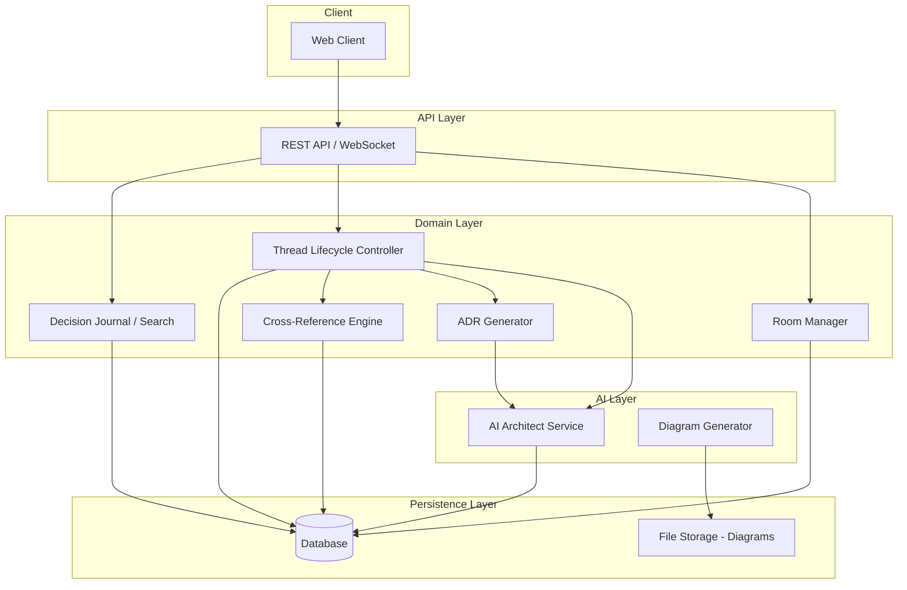
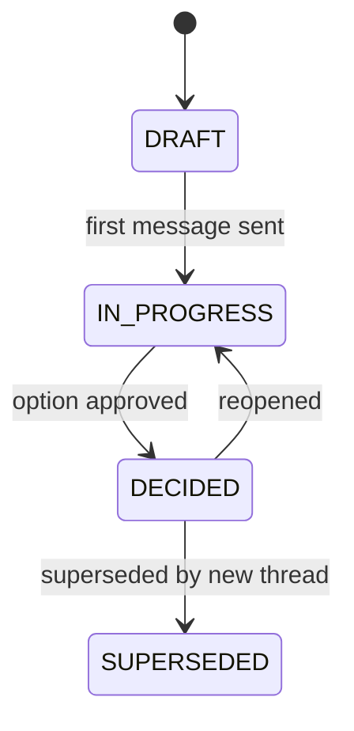

# Design Document: Architecture Decision Room

## Overview

Chalk is a full-stack application providing a persistent workspace where teams collaborate with an AI Architect agent to deliberate and document architecture decisions. The system manages project-level Rooms containing Decision Threads that flow through a defined lifecycle (DRAFT → IN_PROGRESS → DECIDED → SUPERSEDED), with AI-powered option analysis, tradeoff comparison, ADR generation, diagram creation, and cross-referencing of prior decisions.

The design prioritizes:
- **Structured deliberation**: A clear state machine governs thread lifecycle transitions
- **Persistent context**: All conversations, decisions, and artifacts survive across sessions
- **AI-augmented analysis**: The AI Architect proposes options, generates tradeoff tables, produces ADRs, and creates .drawio diagrams
- **Decision traceability**: Cross-references and a searchable journal connect decisions over time

## Architecture

The system follows a layered architecture with clear separation between the API layer, domain logic, AI integration, persistence, and search.



**Key Architectural Decisions:**

1. **State machine for thread lifecycle**: Transitions are validated by a deterministic state machine, preventing invalid states and making the lifecycle testable independently of I/O.
2. **Event-driven AI interactions**: AI responses are triggered by domain events (message sent, decision made, thread opened) rather than tightly coupling AI logic to controllers.
3. **Separation of search from persistence**: Full-text search uses an index that can be rebuilt from the source-of-truth persistence layer.
4. **File-based diagram storage**: .drawio XML files are stored on the filesystem alongside the room data, referenced by relative path in ADRs.

## Components and Interfaces

### Room Manager

Responsible for CRUD operations on Rooms and enforcing naming constraints.

```typescript
interface RoomManager {
  createRoom(name: string): Result<Room, RoomCreationError>;
  getRoom(roomId: string): Result<Room, NotFoundError>;
  listRooms(): Room[];
}

type RoomCreationError =
  | { type: "empty_name" }
  | { type: "name_too_long"; maxLength: 100 }
  | { type: "duplicate_name"; existingRoomId: string };
```

### Thread Lifecycle Controller

Manages Decision Thread state transitions via a finite state machine.

```typescript
interface ThreadLifecycleController {
  createThread(roomId: string, topic: string): Result<DecisionThread, Error>;
  sendMessage(threadId: string, content: string): Result<Message, PersistenceError>;
  approveOption(threadId: string, optionId: string): Result<DecisionThread, TransitionError>;
  reopenThread(threadId: string): Result<DecisionThread, TransitionError>;
  supersedeThread(threadId: string, replacingThreadId: string): Result<DecisionThread, TransitionError>;
}

type TransitionError = {
  type: "invalid_transition";
  currentStatus: ThreadStatus;
  attemptedStatus: ThreadStatus;
  validTransitions: ThreadStatus[];
};
```

### AI Architect Service

Handles all AI-powered analysis including option proposals, clarifying questions, and tradeoff generation.

```typescript
interface AIArchitectService {
  proposeOptions(thread: DecisionThread): Promise<OptionProposal>;
  askClarifyingQuestions(thread: DecisionThread): Promise<ClarifyingQuestions | null>;
  regenerateAnalysis(thread: DecisionThread, newConstraints: string): Promise<OptionProposal>;
  respondToObjection(thread: DecisionThread, objection: string): Promise<RevisedProposal>;
}

interface OptionProposal {
  options: ArchitectureOption[];  // 2-5 options
  tradeoffTable: TradeoffTable;
  assumptions?: string[];         // stated when info is missing
}

interface ArchitectureOption {
  id: string;
  summary: string;               // max 200 chars
  benefits: string[];            // min 2
  risks: string[];               // min 2
  complexity: "Low" | "Medium" | "High";
}
```

### ADR Generator

Produces structured ADR documents from decided threads.

```typescript
interface ADRGenerator {
  generateADR(thread: DecisionThread): Promise<Result<ADR, ADRGenerationError>>;
  updateADRStatus(adrId: string, status: ADRStatus, supersededBy?: string): Result<ADR, Error>;
}

type ADRGenerationError =
  | { type: "insufficient_context"; missingSections: string[] }
  | { type: "system_error"; message: string; retriesRemaining: number };
```

### Cross-Reference Engine

Discovers and manages relationships between decisions.

```typescript
interface CrossReferenceEngine {
  findRelatedDecisions(thread: DecisionThread, allThreads: DecisionThread[]): RelatedDecision[];
  detectContradictions(option: ArchitectureOption, existingADRs: ADR[]): Contradiction[];
  detectDependencies(option: ArchitectureOption, existingADRs: ADR[]): Dependency[];
  summarizeChangesSince(date: Date, room: Room): RoomChangeSummary;
}
```

### Decision Journal (Search)

Provides full-text and structured search across the decision history.

```typescript
interface DecisionJournal {
  search(query: SearchQuery): Result<SearchResults, SearchError>;
}

interface SearchQuery {
  text: string;               // must be non-empty, non-whitespace
  filters?: {
    status?: ThreadStatus;
    dateFrom?: Date;
    dateTo?: Date;
  };
  limit?: number;             // max 50
}

interface SearchResults {
  matches: SearchMatch[];     // ranked by relevance
  totalCount: number;
}

interface SearchMatch {
  threadId: string;
  title: string;
  status: ThreadStatus;
  date: Date;
  summary: string;            // max 200 chars
}
```

### Diagram Generator

Creates .drawio XML files for infrastructure architecture decisions.

```typescript
interface DiagramGenerator {
  generateDiagram(thread: DecisionThread): Promise<Result<DiagramFile, DiagramError>>;
  generateOptionComparison(options: ArchitectureOption[]): Promise<Result<DiagramFile, DiagramError>>;
}

interface DiagramFile {
  fileName: string;
  relativePath: string;
  content: string;            // .drawio XML
}
```

## Data Models

### Room

```typescript
interface Room {
  id: string;                          // unique identifier (UUID)
  name: string;                        // 1-100 characters
  createdAt: Date;
  threads: DecisionThread[];
}
```

### Decision Thread

```typescript
interface DecisionThread {
  id: string;                          // unique within Room
  roomId: string;
  topic: string;
  status: ThreadStatus;
  messages: Message[];
  options: ArchitectureOption[];
  tradeoffTable?: TradeoffTable;
  selectedOptionId?: string;
  adr?: ADR;
  crossReferences: CrossReference[];
  createdAt: Date;
  statusHistory: StatusTransition[];
}

type ThreadStatus = "DRAFT" | "IN_PROGRESS" | "DECIDED" | "SUPERSEDED";

interface StatusTransition {
  from: ThreadStatus;
  to: ThreadStatus;
  timestamp: Date;
  metadata?: Record<string, string>;   // e.g., reopening marker, superseding thread
}
```

### Thread Status State Machine



Valid transitions:
| From | To | Trigger |
|------|-----|---------|
| DRAFT | IN_PROGRESS | First message sent |
| IN_PROGRESS | DECIDED | User approves option |
| DECIDED | IN_PROGRESS | User reopens thread |
| DECIDED | SUPERSEDED | New thread supersedes |

### Message

```typescript
interface Message {
  id: string;
  threadId: string;
  sender: "user" | "ai_architect";
  content: string;
  timestamp: Date;
}
```

### ADR

```typescript
interface ADR {
  id: string;                          // sequential within Room: "ADR-001", "ADR-002", etc.
  title: string;
  date: Date;
  status: "ACCEPTED" | "SUPERSEDED";
  context: string;
  optionsConsidered: ArchitectureOption[];
  decision: string;
  consequences: string;
  relatedDecisions?: RelatedDecisionRef[];
  diagrams?: DiagramRef[];
}

interface RelatedDecisionRef {
  adrId: string;
  title: string;
}

interface DiagramRef {
  fileName: string;
  relativePath: string;
}
```

### Tradeoff Table

```typescript
interface TradeoffTable {
  options: string[];                   // option IDs (rows)
  constraints: string[];               // user's constraints (columns)
  cells: TradeoffCell[][];             // [option_index][constraint_index]
  version: number;                     // increments on regeneration
}

interface TradeoffCell {
  rating: "Strong" | "Moderate" | "Weak" | "N/A";
  explanation: string;
}
```

### Cross-Reference

```typescript
interface CrossReference {
  fromThreadId: string;
  toThreadId: string;
  relationship: "depends_on" | "contradicts" | "supersedes" | "related";
  description: string;
}
```


## Correctness Properties

*A property is a characteristic or behavior that should hold true across all valid executions of a system — essentially, a formal statement about what the system should do. Properties serve as the bridge between human-readable specifications and machine-verifiable correctness guarantees.*

### Property 1: Room creation invariants

*For any* string of length 1 to 100 characters (inclusive) that does not duplicate an existing room name, calling `createRoom` shall produce a Room with a unique non-empty ID, the exact name provided, a creation timestamp not in the future, and an empty threads list.

**Validates: Requirements 1.1, 1.2**

### Property 2: Room name validation rejects invalid inputs

*For any* string that is empty, composed entirely of whitespace, exceeds 100 characters, or duplicates an existing room name, calling `createRoom` shall return an error indicating the specific reason for rejection, and no Room shall be created.

**Validates: Requirements 1.5**

### Property 3: Room view includes all threads

*For any* Room containing N Decision_Threads, the view representation shall include exactly N entries, each containing the thread's current Thread_Status and creation date.

**Validates: Requirements 1.3**

### Property 4: Thread creation produces DRAFT status

*For any* valid Room and topic string, creating a new Decision_Thread shall produce a thread with Thread_Status DRAFT, a unique identifier within the Room, and the given topic.

**Validates: Requirements 2.1**

### Property 5: Valid state machine transitions

*For any* Decision_Thread, the following transitions shall succeed and update the status accordingly: DRAFT → IN_PROGRESS (on first message), IN_PROGRESS → DECIDED (on option approval), DECIDED → IN_PROGRESS (on reopen, preserving all messages and appending a reopening marker), DECIDED → SUPERSEDED (on supersede, storing cross-reference to replacing thread).

**Validates: Requirements 2.2, 2.3, 2.4, 2.5**

### Property 6: Invalid state machine transitions are rejected

*For any* Decision_Thread in any Thread_Status, attempting a transition not in the valid transitions set shall be rejected with an error that specifies the current status, the attempted status, and the list of valid transitions from the current state.

**Validates: Requirements 2.6**

### Property 7: Option proposal structural invariants

*For any* OptionProposal generated by the AI Architect, the proposal shall contain between 2 and 5 options (inclusive), each option shall differ from every other option in at least one primary architectural approach, each option shall have a summary of at most 200 characters, at least 2 benefits, at least 2 risks, and a complexity rating in {Low, Medium, High}. The associated TradeoffTable shall have one row per option and one column per stated constraint, with each cell containing a valid rating.

**Validates: Requirements 3.1, 3.2, 3.3**

### Property 8: Clarifying questions include relevance explanations

*For any* set of clarifying questions produced by the AI Architect, each question shall include a non-empty explanation referencing the specific constraint or tradeoff it would clarify.

**Validates: Requirements 4.2**

### Property 9: ADR contains all required sections

*For any* Decision_Thread that transitions to DECIDED, the generated ADR shall contain: a sequential identifier matching the pattern "ADR-NNN" within the Room, a title, a date, status "ACCEPTED", context, options considered, decision, and consequences. If the thread has Cross_References, the ADR shall include a "Related Decisions" section listing each referenced ADR by ID and title. If diagrams were generated, the ADR shall include a "Diagrams" section with file name and relative path for each diagram.

**Validates: Requirements 5.1, 5.3, 8.2**

### Property 10: Superseded ADR status update

*For any* ADR with status "ACCEPTED", when its Decision_Thread is superseded, the ADR's status shall become "SUPERSEDED" and it shall store a reference to the superseding ADR's identifier.

**Validates: Requirements 5.4**

### Property 11: Cross-reference detection for shared attributes

*For any* pair of Decision_Threads or ADRs that share constraints, technology choices, or problem domain keywords, the Cross-Reference Engine shall identify the relationship and produce a reference with the correct ADR identifier and a description of the relevance.

**Validates: Requirements 6.2**

### Property 12: Contradiction and dependency detection

*For any* proposed ArchitectureOption that contradicts a prior DECIDED ADR (e.g., proposes a technology explicitly rejected in the prior ADR) or depends on an assumption from a prior ADR, the Cross-Reference Engine shall identify the specific prior ADR by identifier, classify the relationship as "contradicts" or "depends_on", and describe the impact.

**Validates: Requirements 6.3**

### Property 13: Room change summary completeness

*For any* Room and a given date, `summarizeChangesSince` shall return all ADRs created after that date, all threads that reference the target thread, and all threads that transitioned to SUPERSEDED after that date.

**Validates: Requirements 6.4**

### Property 14: Search results structural invariants

*For any* search query against any dataset, the results shall contain at most 50 matches, each match shall include a non-null title, Thread_Status, date, and a summary of at most 200 characters, and results shall be ordered by descending relevance score.

**Validates: Requirements 7.1, 7.3**

### Property 15: Search filters produce correct subsets

*For any* search query with a status filter, all returned results shall have that status. For any search with a date range filter, all returned results shall have dates within the specified range (inclusive).

**Validates: Requirements 7.2**

### Property 16: Empty search query rejection

*For any* string that is empty or composed entirely of whitespace characters, the Decision_Journal shall reject the search without executing it and return an error indicating a non-empty query is required.

**Validates: Requirements 7.5**

### Property 17: Persistence round-trip preserves all data

*For any* Room containing Decision_Threads with messages, ADRs, Thread_Status values, Cross_References, TradeoffTables, and timestamps, serializing and then deserializing the Room shall produce a value deeply equal to the original.

**Validates: Requirements 1.4, 9.1, 9.3**

## Error Handling

### Persistence Failures

- **Write failures**: When persistence encounters a write error, the system retries up to 3 times with exponential backoff.
- **Retry exhaustion**: If all 3 retries fail, the system displays an error to the user and preserves unsaved content in a local buffer. The buffer is flushed when persistence is restored.
- **Read failures**: On room open/restore, a read failure surfaces a user-facing error. No retry is needed since the user can try again.

### ADR Generation Failures

- **Insufficient context**: The ADR Generator identifies which required sections (context, options, decision, consequences) lack sufficient information and returns a structured error listing them.
- **System errors**: On transient failure, the system retries ADR generation up to 3 times. After exhaustion, the thread remains DECIDED but without an ADR, and the user is notified.

### Diagram Generation Failures

- **Non-blocking**: Diagram generation failure does not block the DECIDED transition. The user is notified with the failure reason, and the ADR is generated without a Diagrams section.

### State Machine Violations

- **Invalid transitions**: The state machine rejects invalid transitions synchronously, returning the current state, attempted state, and valid transitions. No side effects occur on rejection.

### Search Failures

- **Empty query**: Rejected at the input validation layer before execution.
- **No results**: Returns an empty result set with a suggestion to broaden search terms.
- **Timeout**: If search exceeds 2 seconds, the operation is cancelled and the user is informed to refine their query.

### AI Service Failures

- **Timeout/unavailability**: AI operations that fail are surfaced to the user with a retry option. The thread state is not altered by failed AI operations.
- **Malformed AI output**: If AI output fails structural validation (e.g., < 2 options, summary > 200 chars), the system logs the violation and requests regeneration before presenting to the user.

## Testing Strategy

### Unit Tests

Focus on deterministic, pure-logic components:

- **State machine transitions**: All valid and invalid transitions with various thread states
- **Room name validation**: Boundary cases (empty, 1 char, 100 chars, 101 chars, whitespace, duplicates)
- **Search query validation**: Empty, whitespace-only, valid queries
- **ADR ID sequencing**: Verify sequential numbering within a room
- **TradeoffTable structure validation**: Correct dimensions, valid cell ratings
- **Cross-reference relationship classification**: Known contradiction/dependency scenarios

### Property-Based Tests

Each correctness property (Properties 1–17) maps to a property-based test using a PBT library (e.g., fast-check for TypeScript). Configuration:

- **Minimum 100 iterations** per property test
- **Tag format**: `Feature: architecture-decision-room, Property {N}: {title}`
- **Generators**: Custom generators for Room, DecisionThread, Message, ADR, ArchitectureOption, TradeoffTable, SearchQuery
- **Shrinking**: Rely on library shrinking to find minimal counterexamples

Key generators:
- `arbitraryRoomName`: String of length 1–100, alphanumeric + spaces
- `arbitraryThread`: DecisionThread with random status, 0–20 messages, 0–5 options
- `arbitraryRoom`: Room with 0–10 threads in various states
- `arbitraryADR`: ADR with all required fields populated randomly
- `arbitrarySearchQuery`: Non-empty string with optional filters

### Integration Tests

- **Persistence round-trip**: Full save/load cycle with real storage backend
- **AI response validation**: End-to-end test with AI service, validating structural constraints
- **Diagram generation**: Verify .drawio file creation and valid XML structure
- **Search performance**: Verify results within 2-second timeout
- **ADR generation timing**: Verify generation within 30-second window

### End-to-End Tests

- **Complete decision workflow**: Create room → create thread → send messages → receive AI options → approve option → verify ADR generated
- **Cross-session persistence**: Start a thread, close session, reopen, verify full context available
- **Supersession flow**: Decide thread A → create thread B → supersede A → verify cross-references and ADR status updates
